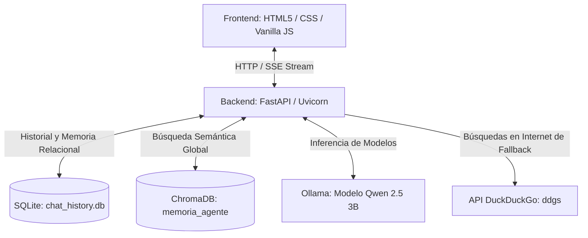
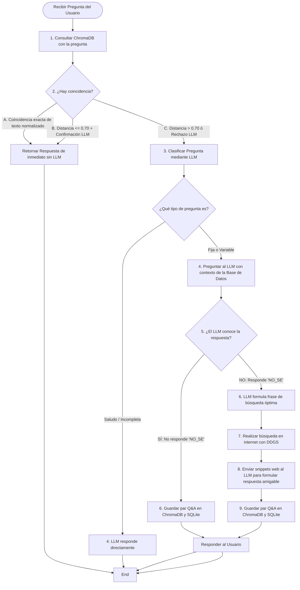

# Documentación Técnica del Sistema - Chatbot con Memoria RAG Global

Este documento proporciona una explicación detallada de la arquitectura, componentes, bases de datos y el flujo de toma de decisiones del chatbot RAG inteligente.

---

## 1. Arquitectura General y Stack Tecnológico

El sistema está construido como una aplicación web de IA de extremo a extremo (End-to-End) y funciona en local. Se compone de las siguientes tecnologías:



### Detalle del Stack
1. **Servidor Backend (Python 3.10+)**: 
   - **FastAPI**: Framwork web moderno y rápido para construir la API.
   - **Uvicorn**: Servidor ASGI de alto rendimiento para correr la aplicación.
2. **Frontend (Web UI)**:
   - **HTML5 & CSS**: Diseño moderno y responsivo con estética premium basada en el modo oscuro de Gemini (gradientes fluidos, efectos de hover, paneles colapsables).
   - **TailwindCSS (CDN)**: Utilidades de diseño rápido.
   - **JavaScript (Vanilla JS)**: Controla las animaciones de la UI, la comunicación por Server-Sent Events (SSE) para respuestas en streaming, el colapso del menú lateral y las ventanas de renombrado.
   - **Marked.js**: Biblioteca integrada para renderizar Markdown (listas, bloques de código, negritas, etc.) directamente en las burbujas del chat.
3. **Modelos de Lenguaje (LLM)**:
   - **Ollama**: Orquestador local para ejecutar modelos como `qwen2.5:3b` con latencia baja y sin depender de APIs de pago externas.
4. **Base de Datos Vectorial (RAG)**:
   - **ChromaDB**: Base de datos vectorial embebida que almacena los conocimientos adquiridos. Se utiliza para identificar si el usuario está realizando preguntas equivalentes semánticamente a algo que el agente ya aprendió o contestó antes.
5. **Base de Datos Relacional (Historial)**:
   - **SQLite**: Almacena de forma persistente los chats creados, el historial de mensajes de cada conversación y un registro histórico de entradas de memoria.
6. **Búsqueda Web**:
   - **ddgs (DuckDuckGo Search)**: Realiza búsquedas de fondo en internet si el LLM no conoce la respuesta a una pregunta.

---

## 2. Flujo de Decisión RAG (Toma de Decisiones)

El agente de IA implementa un flujo inteligente que prioriza el conocimiento existente sobre las llamadas costosas al LLM.



---

## 3. Esquemas y Gestión de Bases de Datos

El sistema maneja dos motores de bases de datos en paralelo para fines distintos:

### A. Base de Datos Relacional (SQLite)
Se almacena localmente en el archivo [chat_history.db](file:///f:/Angelo%20Archivos/IA/chat_history.db). Contiene tres tablas principales gestionadas en [history_store.py](file:///f:/Angelo%20Archivos/IA/app/history_store.py):

#### 1. Tabla `chats`
Representa cada hilo de conversación creado por el usuario en el panel izquierdo.
* `chat_id` (TEXT, Primary Key): Identificador único UUID del chat.
* `title` (TEXT): Título amigable del chat (renombrable).
* `created_at` (TEXT): Timestamp ISO del momento de creación.
* `updated_at` (TEXT): Timestamp ISO de la última interacción, utilizado para ordenar los chats por orden de actualización descendente.

#### 2. Tabla `messages`
Almacena todos los mensajes de ida y vuelta de la conversación.
* `id` (INTEGER, Primary Key AUTOINCREMENT)
* `chat_id` (TEXT, Foreign Key): Referencia al chat correspondiente.
* `role` (TEXT): El rol del emisor (`user` o `assistant`).
* `content` (TEXT): El contenido en texto plano o markdown del mensaje.
* `source` (TEXT, Nullable): Fuente del mensaje (ej: `internet`, `database_memory`, `ollama`).
* `question_type` (TEXT, Nullable): Categoría de la pregunta (ej: `fija`, `variable`, `saludo`).
* `created_at` (TEXT): Timestamp ISO de creación del mensaje.

#### 3. Tabla `memory_entries`
Historial de datos recuperados y guardados en memoria asociativa.
* `id` (INTEGER, Primary Key AUTOINCREMENT)
* `chat_id` (TEXT, Foreign Key)
* `query` (TEXT): Pregunta del usuario.
* `content` (TEXT): Respuesta que se asoció a esa pregunta.
* `source` (TEXT): Origen de la información.
* `created_at` (TEXT)

---

### B. Base de Datos Vectorial (ChromaDB)
Se almacena de forma persistente en la carpeta [memoria_agente/](file:///f:/Angelo%20Archivos/IA/memoria_agente). Se utiliza para el almacenamiento y recuperación de conocimiento asociativo basado en similitud semántica.

* **Colección**: `conocimiento_general`.
* **Embeddings**: ChromaDB utiliza por defecto el modelo `all-MiniLM-L6-v2` para vectorizar textos a vectores de 384 dimensiones.
* **Documento Vectorizado**: El texto de la **Pregunta original** realizada por el usuario (ej: *"¿Cuál es la fórmula del agua?"*).
* **Metadatos asociados**:
  ```json
  {
    "answer": "La fórmula química del agua es H2O...",
    "chat_id": "9efa95fd-b783-460a-9f0c-60cdcb9bd5d8",
    "question_type": "fija",
    "type": "qa_pair"
  }
  ```

#### Búsqueda Global y Coincidencia en Caché (Bypass de Flujo)
* **Búsqueda Global**: Al buscar conocimiento en ChromaDB, no se aplica ningún filtro de `chat_id`. Esto significa que si el chatbot aprende algo en la *"Conversación A"*, el conocimiento se comparte de inmediato y estará disponible de forma global para responder preguntas similares en la *"Conversación B"*.
* **Estrategia de Coincidencia de Preguntas**: Para evitar procesar de nuevo preguntas similares y realizar búsquedas web o inferencias complejas de forma innecesaria, se aplican dos niveles de verificación secuencial sobre los 5 resultados más cercanos de ChromaDB:
  1. **Coincidencia Exacta Normalizada (Sin llamadas a LLM)**: Se aplica una normalización básica del texto de la pregunta (conversión a minúsculas, eliminación de acentos/tildes, eliminación de signos de puntuación como `¿?¡!.` y eliminación de espacios redundantes). Si el texto normalizado de la pregunta actual es idéntico al de una pregunta previamente guardada, se retorna su respuesta asociada de inmediato.
  2. **Coincidencia Semántica Inteligente (`distancia <= 0.70` + Verificación por LLM)**: Si el texto no es idéntico pero la distancia calculada por ChromaDB es menor o igual a `0.70`, el sistema realiza una llamada rápida a Ollama (`son_preguntas_equivalentes`) para validar si ambas preguntas tienen exactamente la misma intención y buscan la misma información. Si el LLM confirma la equivalencia semántica, se retorna la respuesta de inmediato.
* **Recuperación de Contexto para RAG (`distancia <= 0.8`)**: Cuando el agente busca contexto histórico para preguntas estables de tipo `fija`, exige que la distancia sea menor o igual a `0.8`. Si la distancia es mayor, se descarta el contexto por considerarlo irrelevante (evitando inyectar ruidos o temas no relacionados), permitiendo que el LLM resuelva la pregunta basándose en su conocimiento interno o el historial.

---


## 4. Clasificación de Preguntas y Búsqueda en Internet

Cuando la pregunta no está registrada en la memoria caché global de ChromaDB, el backend entra al flujo normal del agente:

1. **Clasificación**: Se llama a Ollama pidiéndole que clasifique la pregunta del usuario en una de estas categorías:
   - `saludo`: Saludos corteses que no requieren base de datos o búsquedas.
   - `incompleta`: Preguntas sin sentido o fragmentadas.
   - `fija`: Preguntas sobre hechos generales, históricos o científicos estables (ej: *"¿Quién descubrió América?"*).
   - `variable`: Preguntas que dependen del tiempo o son de actualidad (ej: *"¿Dónde será el próximo mundial?"*).
2. **Manejo del Fallback (`"NO_SE"`)**:
   - En preguntas de tipo `fija` o `variable`, el agente le pregunta al LLM local. 
   - Diseñamos el prompt del sistema del LLM para que devuelva explícitamente la palabra clave **`NO_SE`** si no cuenta con información suficiente o actualizada sobre el tema.
   - Al detectar la respuesta `NO_SE`, el sistema invoca al LLM para que formule una palabra/frase de búsqueda optimizada para motores de búsqueda (ej. de *"¿Dónde será el mundial de fútbol 2026?"* extrae *"Mundial 2026 sedes ciudades"*).
   - Se ejecuta una búsqueda en DuckDuckGo usando la biblioteca `ddgs` de Python para traer los 3 resultados más relevantes.
   - Se le entrega esa información de internet estructurada al LLM para que redacte una respuesta final coherente al usuario.
   - **Aprendizaje Activo**: Esta respuesta generada a partir de internet se guarda de inmediato en ChromaDB y SQLite como un par Q&A para que en la próxima pregunta similar el agente ya la "sepa" directamente.

---

## 5. Estructura de Archivos del Proyecto

El repositorio está organizado de la siguiente manera:

```text
IA/
├── chat_history.db               # Base de datos SQLite (Chats y Mensajes)
├── memoria_agente/               # Directorio persistente de vectores de ChromaDB
├── requirements.txt              # Definición de paquetes pip (FastAPI, ddgs, ollama, etc.)
├── pyproject.toml                # Configuración de dependencias moderna para gestores como UV
├── README.md                     # Manual básico de uso y arranque
└── app/
    ├── main.py                   # Rutas y Endpoints HTTP / Event Streams (FastAPI)
    ├── agent.py                  # Lógica del Agente RAG, clasificación, búsquedas y ChromaDB
    ├── history_store.py          # Consultas relacionales para SQLite (Historial de Chats)
    ├── templates/
    │   ├── base.html             # Estructura HTML base con importaciones CSS/JS y CDN de Tailwind
    │   └── index.html            # UI principal, composición de Sidebar y área de chat
    └── static/
        ├── css/
        │   └── chat.css          # Estilos detallados del tema oscuro, transiciones y animaciones
        └── js/
            └── chat.js           # Lógica frontend (Renombrar, colapsar sidebar y llamadas a API)
```

---

## 6. Comandos Útiles de Operación

* **Instalar Dependencias**:
  ```bash
  pip install -r requirements.txt
  ```
  *(o utilizando `uv` para descargas ultra rápidas: `uv pip install -r requirements.txt`)*

* **Iniciar el Servidor Web (Local)**:
  ```bash
  uvicorn app.main:app --host 0.0.0.0 --port 8000
  ```

* **Descargar el modelo en Ollama**:
  ```bash
  ollama pull qwen2.5:3b
  ```
